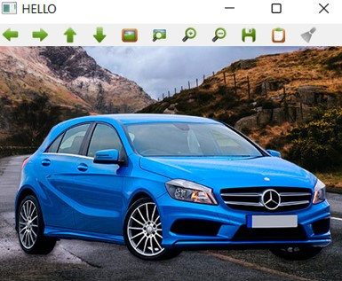
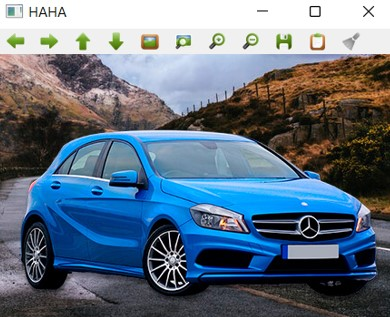
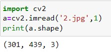
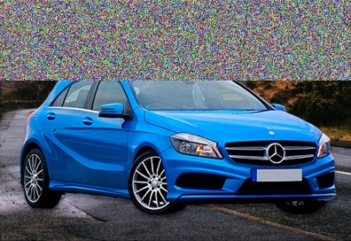

# READ AND WRITE AN IMAGE:

## AIM:

To write a python program using OpenCV to do the following image manipulations:

i) Read, display, and write an image.

ii) Access the rows and columns in an image.

iii) Cut and paste a small portion of the image.

## Software Required:
Anaconda - Python 3.7.
## Algorithm:
### Step1:
Choose an image and save it as a filename.jpg.
### Step2:
Use imread(filename, flags) to read the file.
### Step3:
Use imshow(window_name, image) to display the image.
### Step4:
Use imwrite(filename, image) to write the image.
### Step5:
End the program and close the output image windows.
## Program:
### Developed By: R.SOMEASVAR,
### Register Number: 212221230103.
## i) To Read,display the image:
~~~
import cv2
color_image=cv2.imread('2.jpg',1)
cv2.imshow('HELLO',color_image)
cv2.waitKey(0)
cv2.destroyAllWindows()
~~~

## ii) To write the image:
~~~
import cv2
a=cv2.imread('2.jpg',1)
cv2.imwrite("20.jpg",a)
cv2.imshow("HAHA",a)
cv2.waitKey(0)
cv2.destroyAllWindows()
~~~
 ## iii) Find the shape of the Image:
~~~
import cv2
a=cv2.imread('2.jpg',1)
print(a.shape)
~~~
## iv) To access rows and columns:
~~~
import random
import cv2
A=cv2.imread("2.jpg",1)
for i in range(100):
    for j in range(A.shape[1]):
        A[i][j]=[random.randint(0,255),random.randint(0,255),random.randint(0,255)]
cv2.imshow("DIE",A)
cv2.waitKey(0)
cv2.destroyAllWindows()
~~~
## v) To cut and paste portion of image:
~~~
import cv2
A=cv2.imread("2.jpg",1)
tag=A[50:150,75:90]
A[25:125,50:65]=tag
cv2.imshow("DIE",A)
cv2.waitKey(0)
cv2.destroyAllWindows()
~~~

## Output:

### i) Read and display the image:

### ii)Write the image:

### iii)Shape of the Image:

### iv)Access rows and columns:
## 1)

## 2)

### v)Cut and paste portion of :

## Result:
Thus the images are read, displayed, and written successfully using the python program.

